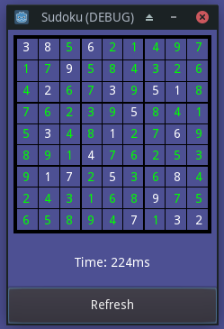

# Godot Sudoku Solver

This small project aims to show how to write code to solve Sudoku puzzles using GDScript.

One of the best articles about this is here: [Solving Sudoku](http://norvig.com/sudoku.html).
Here are [95 hard puzzles](http://norvig.com/top95.txt).
